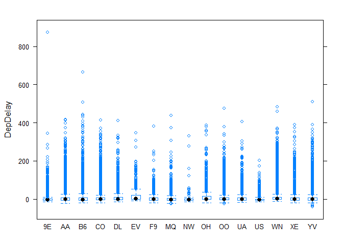

Exercise 1.1
============

What we are trying to do.

Cleaning data
-------------

The reason we got rid of cancelled or diverted flight from data.

Q1. Which Airplane company makes most delays?
---------------------------------------------

    ##     DepDelay UniqueCarrier
    ## 9E  5.648714            9E
    ## AA  8.716406            AA
    ## B6 11.344901            B6
    ## CO  9.148193            CO
    ## DL 11.469417            DL
    ## EV 16.560644            EV
    ## F9  4.352748            F9
    ## MQ  6.686873            MQ
    ## NW  8.389831            NW
    ## OH 12.681896            OH
    ## OO  8.901623            OO
    ## UA  9.985931            UA
    ## US  1.004124            US
    ## WN  9.514654            WN
    ## XE  6.438455            XE
    ## YV 11.579890            YV

!(Rplot.png)(<a href="https://github.com/jiehonshim/hw1/blob/master/Rplot.png?raw=true" class="uri">https://github.com/jiehonshim/hw1/blob/master/Rplot.png?raw=true</a>)
This result tells us..
